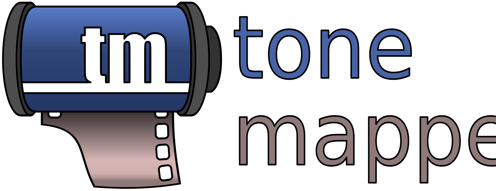

# tonemapper — A tool for exploring and applying various tonemapping operators.

## Description

Tonemapper is a an application to compare and apply various tone mapping operators...

1. ... either via the command line interface:

```
# Example: apply the "Reinhard" operator with gamma=2.2 to a list of input images
./tonemapper --operator reinhard --gamma 2.2 <images>
```

2. ... or via an interactive GUI:

```
./tonemapper --gui
```


### Supported file formats:

* **Input**: `.exr` & `.hdr`
* **Output**: `.jpg` & `.png`

### Available operators:

* **Gamma**: Standard gamma correction only
* **sRGB**: Conversion to sRGB color space

<p></p>

* **Clampling**
* **Maximum division**
* **Mean value**
* **Exponential**
* **Exponentiation**
* **Logarithmic**

<p></p>

* **Tumblin Rushmeier**: From "[Tone Reproduction for Realistic Images](https://www2.eecs.berkeley.edu/Research/Projects/CS/vision/classes/cs294-appearance_models/sp2001/cache/tumblin93.pdf)" by by Tumblin and Rushmeier 1993
* **Schlick**: From "[Quantization Techniques for Visualization of High Dynamic Range Pictures](https://www.researchgate.net/publication/2272006_Quantization_Techniques_for_Visualization_of_High_Dynamic_Range_Pictures)" by Schlick 1994
* **Ward**: From "[A contrast-based scalefactor for luminance display](https://gaia.lbl.gov/btech/papers/35252.pdf)" by Ward 1994
* **Ferwerda**: From "[A Model of Visual Adaptation for Realistic Image Synthesis](http://web.cse.ohio-state.edu/~parent.1/classes/782/Papers/Ferwerda96.pdf)" by Ferwerda et al. 1996
* **Durand Dorsey**: From "[Interactive Tone Mapping](https://graphics.cs.yale.edu/publications/interactive-tone-mapping)" by Durand and Dorsey 2000
* **Reinhard**: From "[Photographic Tone Reproduction For Digital Images](https://www.researchgate.net/publication/2908938_Photographic_Tone_Reproduction_For_Digital_Images)" by Reinhard et al. 2002
* **Reinhard (Extended)**: From "[Photographic Tone Reproduction For Digital Images](https://www.researchgate.net/publication/2908938_Photographic_Tone_Reproduction_For_Digital_Images)" by Reinhard et al. 2002
* **Drago**: From "[Adaptive Logarithmic Mapping For Displaying High Contrast Scenes](http://resources.mpi-inf.mpg.de/tmo/logmap/logmap.pdf)" by Drago et al. 2003
* **Reinhard Devlin**: From "[Dynamic Range Reduction Inspired by Photoreceptor Physiology](https://www.researchgate.net/publication/8100146_Dynamic_Range_Reduction_Inspired_by_Photoreceptor_Physiology)" by Reinhard and Devlin 2005

<p></p>

* **Hejl Burgess-Dawson Filmic**: By Jim Hejl and Richard Burgess-Dawson presented in the "[Filmic Tonemapping for Real-time Rendering](https://de.slideshare.net/hpduiker/filmic-tonemapping-for-realtime-rendering-siggraph-2010-color-course)" SIGGRAPH 2010 course by Haarm-Pieter Duiker
* **Aldridge Filmic**: From the "[Approximating Film with Tonemapping](http://iwasbeingirony.blogspot.com/2010/04/approximating-film-with-tonemapping.html)" blog post by Graham Aldridge
* **Hable Filmic**: By John Hable presented in the "[Filmic Tonemapping for Real-time Rendering](https://de.slideshare.net/hpduiker/filmic-tonemapping-for-realtime-rendering-siggraph-2010-color-course)" SIGGRAPH 2010 course by Haarm-Pieter Duiker
* **Hable (Updated) Filmic**: From the "[Filmic Tonemapping with Piecewise Power Curves](http://filmicworlds.com/blog/filmic-tonemapping-with-piecewise-power-curves/)" blog post by John Hable.
* **Lottes Filmic**: From the "[Advanced Techniques and Optimization of HDR Color Pipelines](https://www.gdcvault.com/play/1023512/Advanced-Graphics-Techniques-Tutorial-Day)" GDC talk by Timothy Lottes
* **Day Filmic**: From the "[An efficient and user-friendly tone mapping operator](https://d3cw3dd2w32x2b.cloudfront.net/wp-content/uploads/2012/09/an-efficient-and-user-friendly-tone-mapping-operator.pdf)" document by Mike Day
* **Uchimura Filmic**: From the "[HDR Theory and Practice](https://www.slideshare.net/nikuque/hdr-theory-and-practicce-jp)" CEDEC talk by Hijime Uchimura

<p></p>

* **Hill ACES**: ACES curve [fit](https://github.com/TheRealMJP/BakingLab/blob/master/BakingLab/ACES.hlsl) by Stephen Hill
* **Narkowicz ACES**: ACES curve [fit](https://knarkowicz.wordpress.com/2016/01/06/aces-filmic-tone-mapping-curve/) by Krzysztof Narkowicz
* **Hill ACES**: ACES curve [fit](https://www.shadertoy.com/view/llXyWr) by Romain Guy

<p></p>

* **Response function data file**: Data-driven curves from external files, e.g. the "[DoRF](https://www.cs.columbia.edu/CAVE/software/softlib/dorf.php)" project from "[What is the Space of Camera Response Functions?](https://www1.cs.columbia.edu/CAVE/publications/pdfs/Grossberg_CVPR03.pdf)" by Grossberg and Nayar 2003


## Building

Clone the repository recursively all dependencies and use CMake to generate project files for your favourite IDE or build system.

```
# Unix example using make:
git clone https://github.com/tizian/tonemapper.git --recursive
cd tonemapper
mkdir build
cd build
cmake ..
make
```

Optionally, the compilation of the GUI can be disabled via a CMake option:
```
cmake .. -DTONEMAPPER_BUILD_GUI=OFF
```

## Third party code

The following external libraries are used:
* [nanogui](https://github.com/mitsuba-renderer/nanogui)
* [tinyexr](https://github.com/syoyo/tinyexr)
* [stb](https://github.com/nothings/stb)
* [tinyformat](https://github.com/c42f/tinyformat)

## License

Tonemapper is provided under the MIT License.

See the LICENSE.txt file for the conditions of the license.
