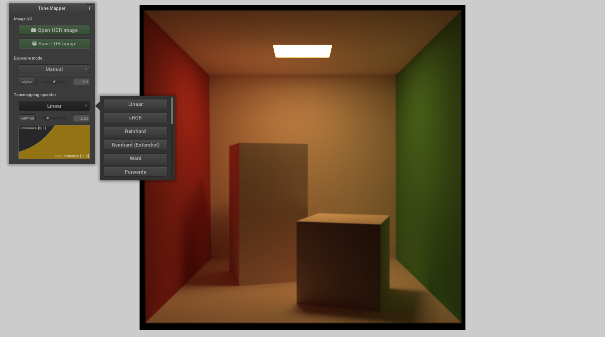

# Tone Mapper


## Description

Tone Mapper is a a small application to compare and apply various tone mapping operators.

It was written for the [Multimedia Communications (HS 2015)](https://graphics.ethz.ch/teaching/mmcom15/home.php) course at ETH Zürich.

Available operators:
* **Linear** - Gamma correction only
* **sRGB** - Conversion to the sRGB color space
* **Reinhard** - From ["Photographic Tone Reproduction for Digital Images"](http://www.cmap.polytechnique.fr/~peyre/cours/x2005signal/hdr_photographic.pdf) by Reinhard et al. 2002
* **Reinhard (Extended)** - From ["Photographic Tone Reproduction for Digital Images"](http://www.cmap.polytechnique.fr/~peyre/cours/x2005signal/hdr_photographic.pdf) by Reinhard et al. 2002
* **Ward** - From ["A contrast-based scalefactor for luminance display"](http://eetd.lbl.gov/sites/all/files/publications/lbl-35252.pdf) by Ward 1994
* **Ferwerda** - From ["A Model of Visual Adaptation for Realistic Image Synthesis"](http://mm.cse.wustl.edu/perceptionseminarresources/sig96.pdf) by Ferwerda et al. 1996
* **Schlick** - From ["Quantization Techniques for Visualization of High Dynamic Range Pictures"](http://citeseerx.ist.psu.edu/viewdoc/download?doi=10.1.1.43.7915&rep=rep1&type=pdf) by Schlick 1994
* **Tumblin-Rushmeier** - From ["Tone Reproduction for Realistic Images"](https://www.eecs.berkeley.edu/Research/Projects/CS/vision/classes/cs294-appearance_models/sp2001/cache/tumblin93.pdf) by by Tumblin and Rushmeier 1993
* **Drago** - From ["Adaptive Logarithmic Mapping For Displaying High Contrast Scenes"](http://resources.mpi-inf.mpg.de/tmo/logmap/logmap.pdf) by Drago et al. 2003
* **Reinhard-Devlin** - From ["Dynamic Range Reduction Inspired by Photoreceptor Physiology"](http://erikreinhard.com/papers/tvcg2005.pdf) by Reinhard and Devlin 2005
* **Filmic** - By Jim Hejl and Richard Burgess-Dawson from the ["Filmic Tonemapping for Real-time Rendering"](http://de.slideshare.net/hpduiker/filmic-tonemapping-for-realtime-rendering-siggraph-2010-color-course) Siggraph 2010 Course by Haarm-Pieter Duiker
* **Uncharted 2** - By John Hable from the ["Filmic Tonemapping for Real-time Rendering"](http://de.slideshare.net/hpduiker/filmic-tonemapping-for-realtime-rendering-siggraph-2010-color-course) Siggraph 2010 Course by Haarm-Pieter Duiker
* **Insomniac** - From ["An efficient and user-friendly tone mapping operator"](http://d3cw3dd2w32x2b.cloudfront.net/wp-content/uploads/2012/09/an-efficient-and-user-friendly-tone-mapping-operator.pdf) by Mike Day
* **Divison by maximum**
* **Mean Value Mapping**
* **Clamping**
* **Logarithmic**
* **Exponential**
* **Exponentiation**



## Building

Clone the repository with all dependencies and use CMake to generate project files for your favourite IDE or build system. Unix example using make:
```
git clone https://github.com/tizian/tonemapper.git --recursive
cd tonemapper
mkdir build
cd build
cmake ..
make
```

Alternatively, pre-compiled builds are available here:

[Tone Mapper v1.0](https://github.com/tizian/tonemapper/releases/download/v1.0-test/Tone.Mapper.1.0.Windows.x64.zip) (Windows x64)

## Third Party Code

The following libraries have been used:

* [nanogui](https://github.com/wjakob/nanogui)
* [filesystem](https://github.com/wjakob/filesystem)
* [tinyexr](https://github.com/syoyo/tinyexr)
* [stb](https://github.com/nothings/stb)
